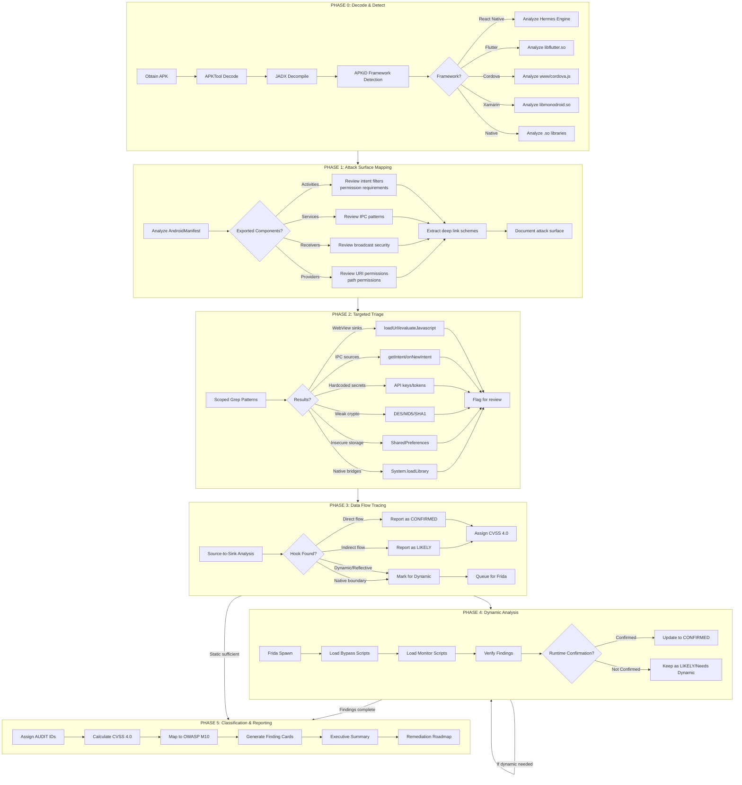
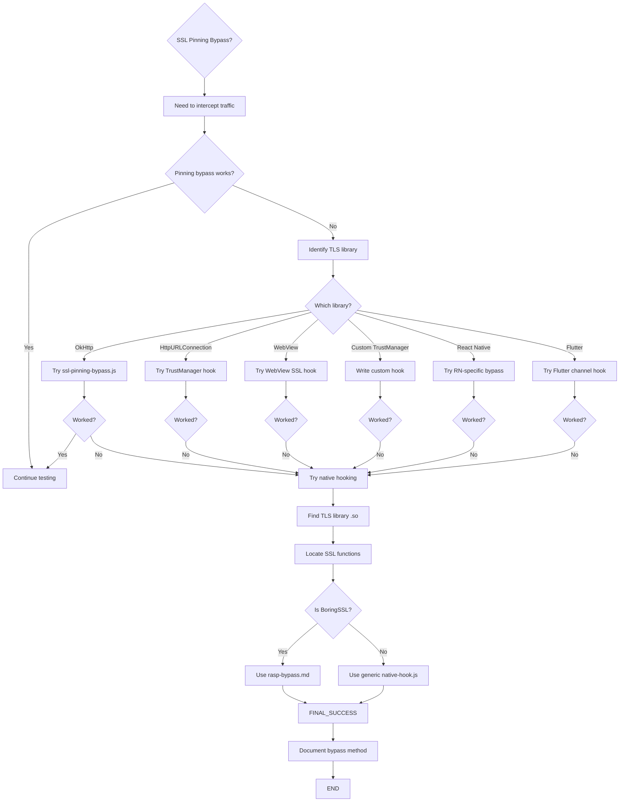
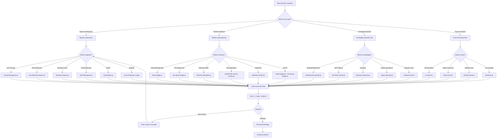
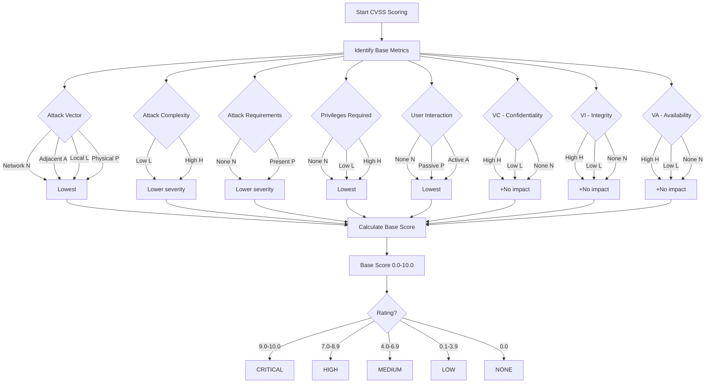
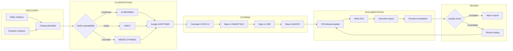
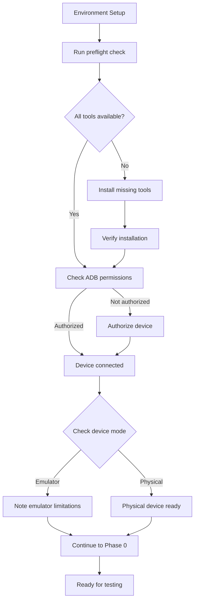

# Android Pentesting Workflow Diagrams

Mermaid-format workflow diagrams for methodology visualization and client presentations.

---

## 6-Phase Pentesting Workflow

---

## Triage Decision Tree

```mermaid
flowchart TD
    START{Component Type} --> ACTIVITY[Activity]
    START --> SERVICE[Service]
    START --> RECEIVER[Receiver]
    START --> PROVIDER[Provider]
    START --> WEBVIEW[WebView]
    START --> DEEPLINK[Deep Link]
    START --> CRYPTO[Crypto/Keys]
    START --> STORAGE[Data Storage]
    START --> NETWORK[Network]

    ACTIVITY -->|exported=true| ACT1{android:permission?}
    ACT1 -->|None| V1[VULNERABLE<br/>Exported without protection]
    ACT1 -->|Defined| ACT2{Check permission level}
    ACT2 -->|signature| V2[Potential issue<br/>Verify signature level]
    ACT2 -->|dangerous| ACT3[Review dangerous flags]
    ACT3 -->|No prompt| V3[VULNERABLE<br/>Prompt bypass possible]
    ACT3 -->|With prompt| OK1[OK - User prompt required]

    SERVICE -->|exported=true| SERV1{android:permission?}
    SERV1 -->|None| V4[VULNERABLE<br/>Unprotected service]
    SERV1 -->|Defined| SERV2[Verify permission]

    RECEIVER -->|exported=true| REC1{android:permission?}
    REC1 -->|None| V5[VULNERABLE<br/>Any app can send broadcast]
    REC1 -->|Defined| REC2[Check protection level]

    PROVIDER -->|exported=true| PROV1{readPermission?}
    PROV1 -->|None| V6[VULNERABLE<br/>No read protection]
    PROV1 -->|Defined| PROV2[Check writePermission]
    PROV2 -->|None| V7[VULNERABLE<br/>No write protection]
    PROV2 -->|Defined| PROV3[Check path permissions]
    PROV3 -->|Wildcard| V8[VULNERABLE<br/>Path traversal possible]

    WEBVIEW -->|JavaScript enabled| WV1{addJavascriptInterface?}
    WV1 -->|Yes - Android 4.2-| V9[CRITICAL<br/>Universal XSS possible]
    WV1 -->|Yes - 4.2+| WV2[verifyJavascriptBridge?]
    WV2 -->|Not verified| V9
    WV2 -->|Verified| WV3[Check URL loading]
    WV3 -->|loadUrl with user input| V10[XSS via URL injection]
    WV3 -->|No user input| OK2[OK]

    DEEPLINK -->|scheme defined| DL1{Validate input?}
    DL1 -->|No validation| V11[VULNERABLE<br/>Deep link injection]
    DL1 -->|Validated| DL2[Check for intent:// redirect]
    DL2 -->|No check| V12[Open redirect possible]
    DL2 -->|Checked| OK3[OK]

    CRYPTO -->|Algorithm| CRYP1{DES/MD5/SHA1?}
    CRYP1 -->|Yes| V13[MEDIUM<br/>Weak crypto algorithm]
    CRYP1 -->|No| CRYP2{Key management?}
    CRYP2 -->|Hardcoded key| V14[HIGH<br/>Hardcoded key found]
    CRYP2 -->|AndroidKeyStore| CRYP3{Certificate pinning?}
    CRYP3 -->|No| V15[MEDIUM<br/>No certificate pinning]

    STORAGE -->|MODE_WORLD_READABLE| V16[VULNERABLE<br/>Other apps can read]
    STORAGE -->|MODE_WORLD_WRITABLE| V17[VULNERABLE<br/>Other apps can write]
    STORAGE -->|No encryption| V18[MEDIUM<br/>Sensitive data unencrypted]
    STORAGE -->|Encrypted| OK4[Review encryption quality]

    NETWORK -->|HTTP URL| V19[MEDIUM<br/>Cleartext traffic]
    NETWORK -->|HTTPS no pinning| V15[MEDIUM<br/>No certificate pinning]
    NETWORK -->|Self-signed cert| V20[LOW<br/>Trusting user certs]

    V1 --> REPORT[Add to Report]
    V2 --> REPORT
    V3 --> REPORT
    V4 --> REPORT
    V5 --> REPORT
    V6 --> REPORT
    V7 --> REPORT
    V8 --> REPORT
    V9 --> REPORT
    V10 --> REPORT
    V11 --> REPORT
    V12 --> REPORT
    V13 --> REPORT
    V14 --> REPORT
    V15 --> REPORT
    V16 --> REPORT
    V17 --> REPORT
    V18 --> REPORT
    V19 --> REPORT
    V20 --> REPORT
    OK1 --> DONE[Continue]
    OK2 --> DONE
    OK3 --> DONE
    OK4 --> DONE
    DONE --> END

    REPORT --> END
```

---

## SSL Pinning Bypass Decision Chart

---

## Frida Script Selection Flowchart

---

## CVSS Severity Calculation Flow

---

## Finding Documentation Flow

---

## Environment Setup Verification

